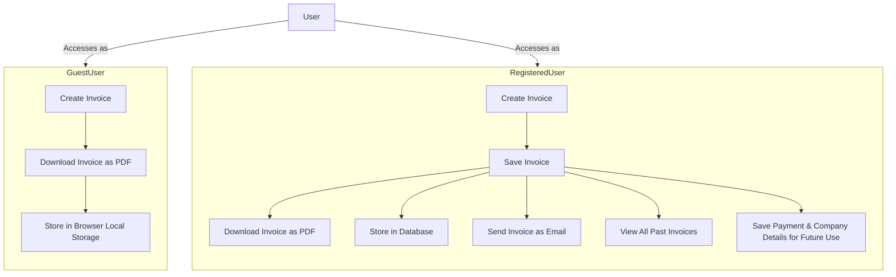

# invoicen

## Repository URL: 
[https://github.com/wanghaisheng/invoicen](https://github.com/wanghaisheng/invoicen)

## Stars: 
**0**

## Forks: 
**0**

## Description: 
Invoicen is a simple invoice generator for freelancers and small businesses. It is a self hostable web application that can be used to generate invoices and download PDFs

## README Content: 
# Invoicen

Invoicen is a simple invoice generator for freelancers and small businesses. It is a self hostable web application that can be used to generate invoices and download PDFs. It is built using [Next.js](https://nextjs.org/).

## Features

1. Create and manage invoice
1. Download invoice as PDF
1. Send invoice as email

## System overview

There will be 2 types of users:

1. As a guest user
1. As a registered user

### Guest User

1. Guest users can create invoices without signing up.
1. They can download the invoice as PDF.
1. The invoice will be stored in the browser's local storage.

### Registered User

1. Registered users can create invoices and save them.
1. They can download the invoice as PDF.
1. The invoice will be stored in the database.
1. They can save their payment details, company details, etc for future use.
1. They can also send the invoice as an email.
1. They can access all the invoices they have created in the past.
1. They can upload their logo which will be displayed in the invoice.

## Types of Invoices

Currently the application supports 2 types of invoices:

1. Time based invoice
1. Product based invoice

### Time based invoice

This type of invoice is used when the user wants to charge the client based on the time spent on the project. The user can add multiple time entries and the application will calculate the total amount based on the hourly rate.

### Product based invoice

This type of invoice is used when the user wants to charge the client based on the products/services provided. The user can add multiple products/services and the application will calculate the total amount based on the price of the product/service.

## Tech Stack

1. [Next.js](https://nextjs.org/)
1. [Tailwind CSS](https://tailwindcss.com/)
1. [Shadcn](https://shadcn.com/)
1. [PostgreSQL](https://www.postgresql.org/)

## Docs

For detailed documentation, please refer to the [wiki](https://github.com/keizerworks/invoicen/wiki).

## Contributing

Take a look at the [contributing guidelines](CONTRIBUTING.md) for this project.

